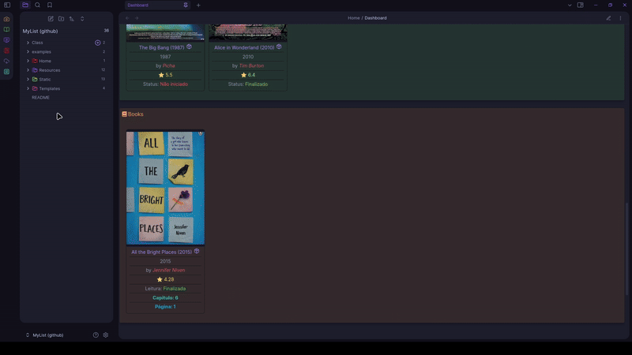

# MyList_obsidian-filme-maga-template
Um template para obsidian para criar lista de filmes, series, mangas, animes, livros de forma fácil e rápida e automática 

## Antes de começa 
- tenha o obsidian instalado https://obsidian.md/
- Crie uma chave de api em [omdbAPI](https://www.omdbapi.com/)
- Insira a chave em: Configurações > Media DB > `OMDb API KEY`
- Apague a pasta `examples` pois ela nao é necessária 

  
## Conheça o Template

- dashboard é onde mostra todos os seus `favoritos` e é atualizado automaticamente quando voce adiciona um novo item.

- Botoes para criar novo filme/serie/anime/manga/livro
- bonus: há um botão para salvar e configurar  todas as imagens localmente

- Criar um livro (igual para todos os itens)

- Atualizar o status de leitura ou a página atual de forma simples
- 

## Sugestão
- para qualquer dica, duvida ou sugestão, crie uma issue nesse repositório

## Plugins
- obsidian://show-plugin?id=obsidian-admonition
- obsidian://show-plugin?id=dataview
- obsidian://show-plugin?id=templater-obsidian
- obsidian://show-plugin?id=obsidian-style-settings
- obsidian://show-plugin?id=obsidian-icon-folder
- obsidian://show-plugin?id=cmdr
- obsidian://show-plugin?id=metadata-menu
- obsidian://show-plugin?id=file-explorer-note-count
- obsidian://show-plugin?id=obsidian-local-images
- obsidian://show-plugin?id=obsidian-media-db-plugin